# 🌍 Wanderlust Mega Project - End-to-End DevOps & GitOps on AWS EKS


---

# 📌 Project Overview

Wanderlust is a full-stack travel blogging platform deployed using modern DevOps and GitOps practices on Amazon EKS.

This project demonstrates a complete production-style DevOps workflow including:

- CI/CD with Jenkins
- Code Quality Analysis using SonarQube
- Security Scanning using Trivy
- Containerization using Docker
- Image Registry using DockerHub
- Kubernetes Deployment on Amazon EKS
- GitOps Deployment using ArgoCD
- Monitoring using Prometheus & Grafana
- Helm Package Management
- NGINX Ingress Controller
- MongoDB Database
- Redis Caching

The complete deployment process is automated from code commit to production deployment.

---

# 🚀 Project Repository

Repository Link:

https://github.com/Riya-te/Wanderlust-Mega-Project-k8s

---

# 🏗 Architecture Diagram


---

# 🔄 Complete DevOps Workflow

```text
Developer
    │
    ▼
GitHub Repository
    │
    ▼
Jenkins CI Pipeline
    │
    ├── SonarQube Analysis
    ├── Trivy Security Scan
    ├── Docker Build
    ├── Docker Push
    └── Update Kubernetes Manifests
    │
    ▼
GitHub Manifest Repository
    │
    ▼
ArgoCD GitOps
    │
    ▼
Amazon EKS Cluster
    │
    ▼
NGINX Ingress Controller
    │
    ▼
Wanderlust Application
    │
    ▼
Prometheus
    │
    ▼
Grafana
```

---

# 🛠 Technology Stack

| Category | Technology |
|-----------|------------|
| Cloud Platform | AWS |
| Container Orchestration | Amazon EKS |
| Containerization | Docker |
| CI/CD | Jenkins |
| Source Control | GitHub |
| GitOps | ArgoCD |
| Package Manager | Helm |
| Monitoring | Prometheus |
| Visualization | Grafana |
| Security Scanning | Trivy |
| Code Quality | SonarQube |
| Reverse Proxy | NGINX Ingress |
| Database | MongoDB |
| Cache | Redis |
| IaC Concepts | Kubernetes Manifests |

---

# ☁️ AWS Infrastructure

## Amazon EKS Cluster

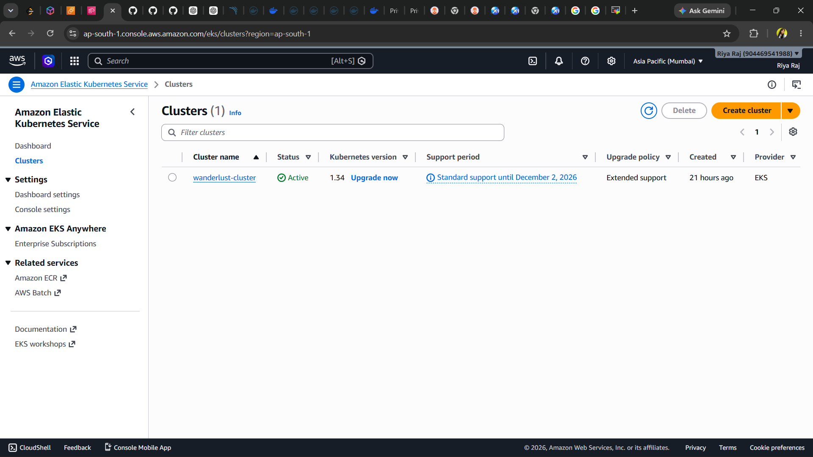

---

## EC2 Instances

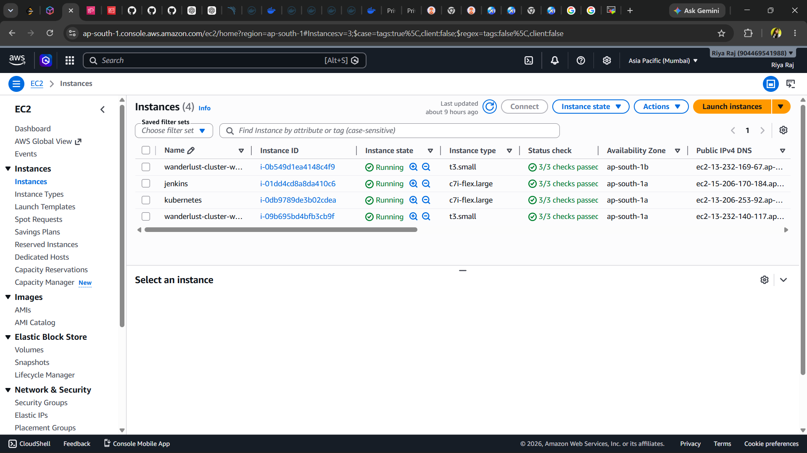

---

# ⚙️ Jenkins CI/CD Pipeline

The Jenkins pipeline automates:

- Source Code Checkout
- SonarQube Analysis
- Trivy Vulnerability Scan
- Docker Image Build
- Docker Image Push
- Kubernetes Manifest Update
- Git Push for GitOps Deployment

---

## Jenkins Pipeline Success

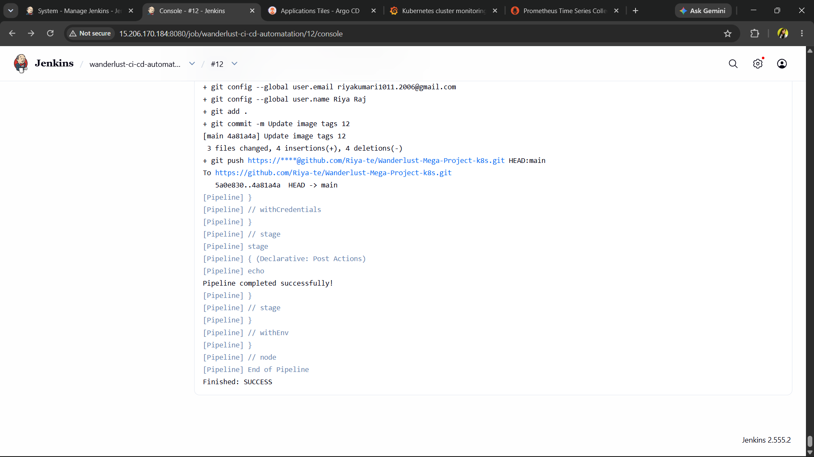

---

## Pipeline Overview

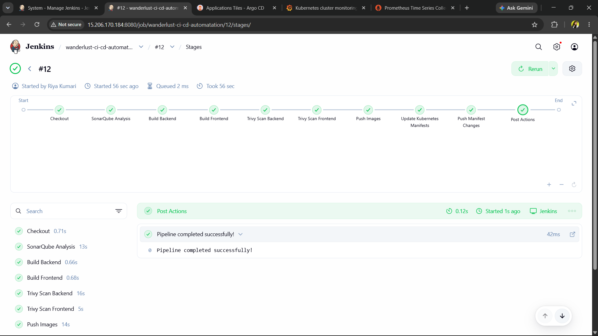

---

# 🔍 SonarQube Integration

SonarQube is integrated into Jenkins for continuous code quality checks.

Features:

- Code Smells Detection
- Bugs Detection
- Security Vulnerabilities
- Maintainability Analysis
- Reliability Analysis

---

## SonarQube Dashboard

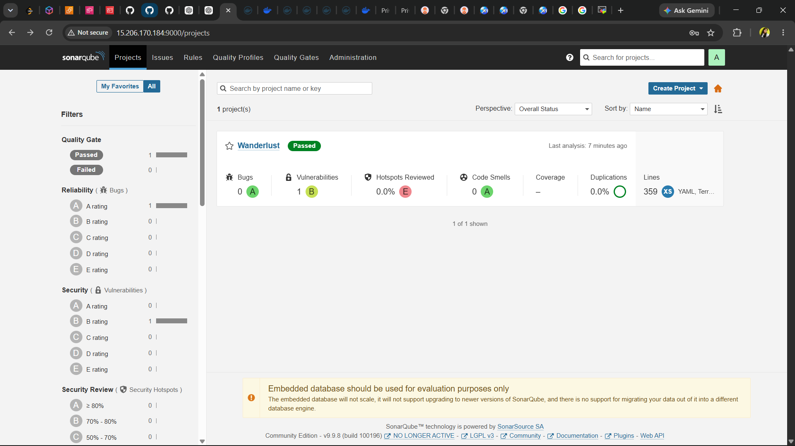

---

# 🛡 Trivy Security Scanning

Trivy is integrated into Jenkins pipeline to scan Docker images.

### Security Checks

- Vulnerabilities
- Secrets Detection
- Dependency Scanning
- Configuration Analysis

---

# 🐳 Docker & DockerHub

Application components are containerized using Docker and pushed to DockerHub.

---

## Backend Image

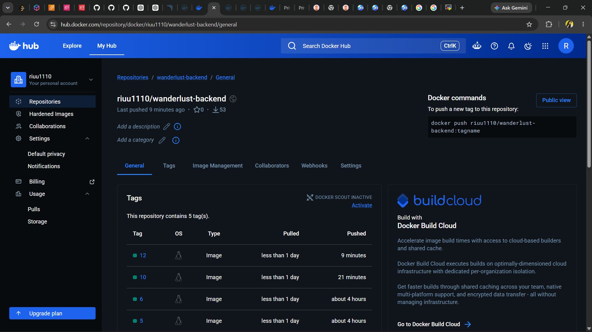

---

## Frontend Image


---

# ☸ Kubernetes Deployment

The application is deployed on Amazon EKS using:

- Deployments
- Services
- Ingress
- Persistent Volumes
- Persistent Volume Claims

Manifest files are maintained inside:

```bash
kubernetes/
```

---

# 🚀 GitOps with ArgoCD

ArgoCD continuously monitors GitHub and automatically syncs application changes to Amazon EKS.

---

## ArgoCD Dashboard

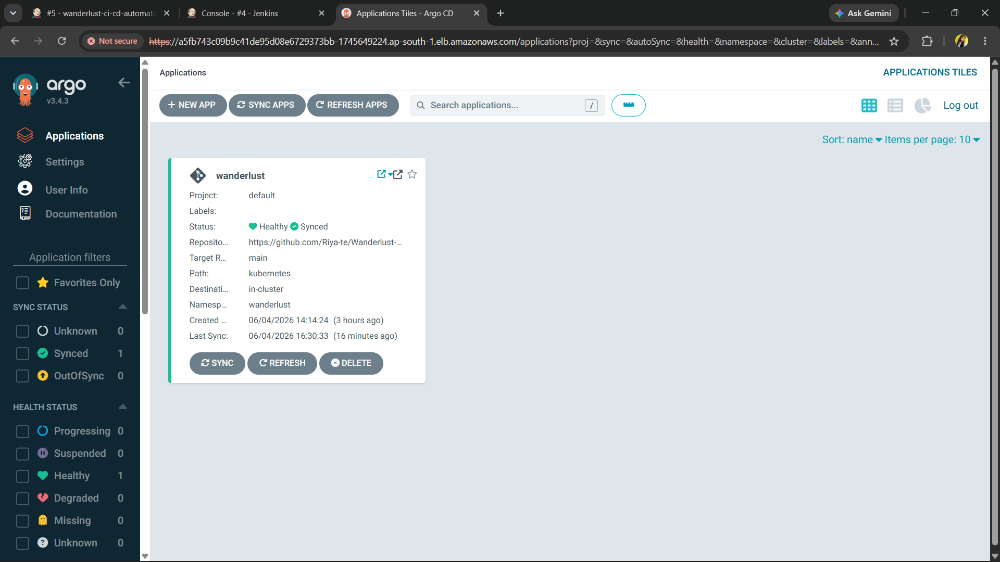

---

## Application Sync

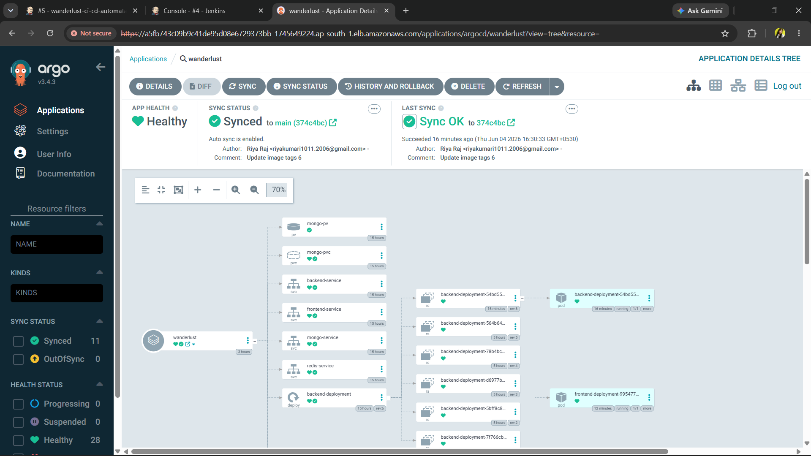

---

## Healthy Deployment

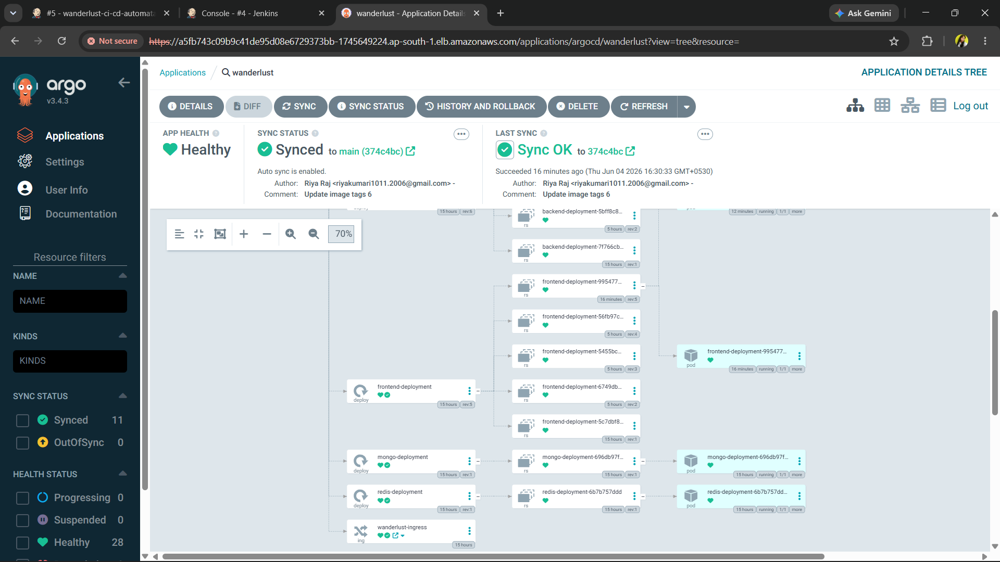

---

# ⎈ Helm Package Management

Helm is used for deploying the monitoring stack.

Components installed using Helm:

- Prometheus
- Grafana
- AlertManager
- Node Exporter
- kube-state-metrics

### Helm Installation

```bash
helm repo add prometheus-community https://prometheus-community.github.io/helm-charts

helm install monitoring prometheus-community/kube-prometheus-stack \
-n monitoring
```

Benefits:

- Easy Installation
- Version Management
- Upgrade Support
- Rollback Support

---

# 📊 Monitoring with Prometheus

Prometheus collects metrics from:

- Kubernetes Nodes
- Pods
- Containers
- Services

---

## Prometheus Dashboard

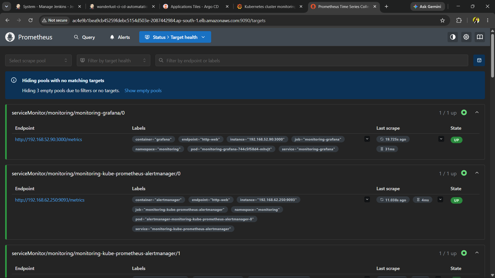

---

# 📈 Grafana Dashboards

Grafana visualizes cluster metrics collected by Prometheus.

Metrics include:

- CPU Usage
- Memory Usage
- Disk Usage
- Network Traffic
- Pod Metrics
- Node Metrics

---

## Grafana Dashboard

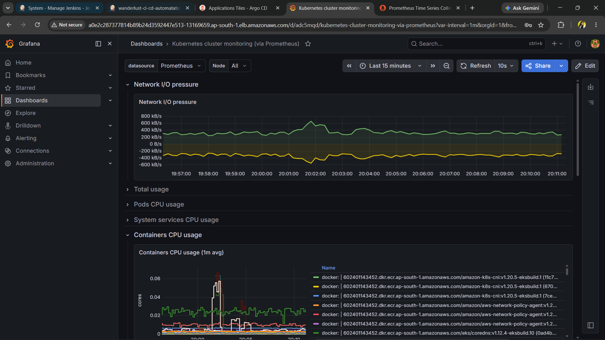

---

# 🌐 Wanderlust Application

## Home Page

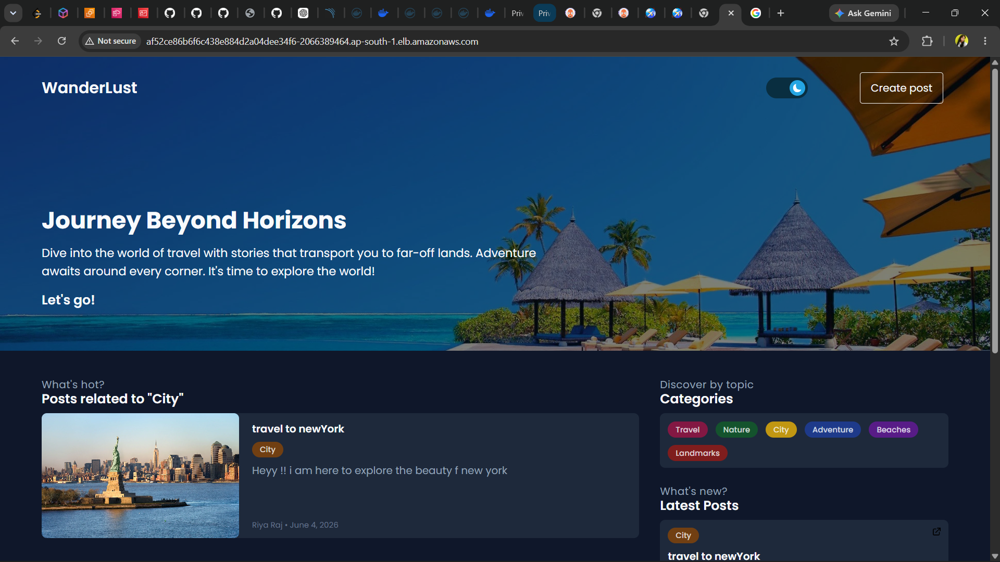

---

## Create Post Page

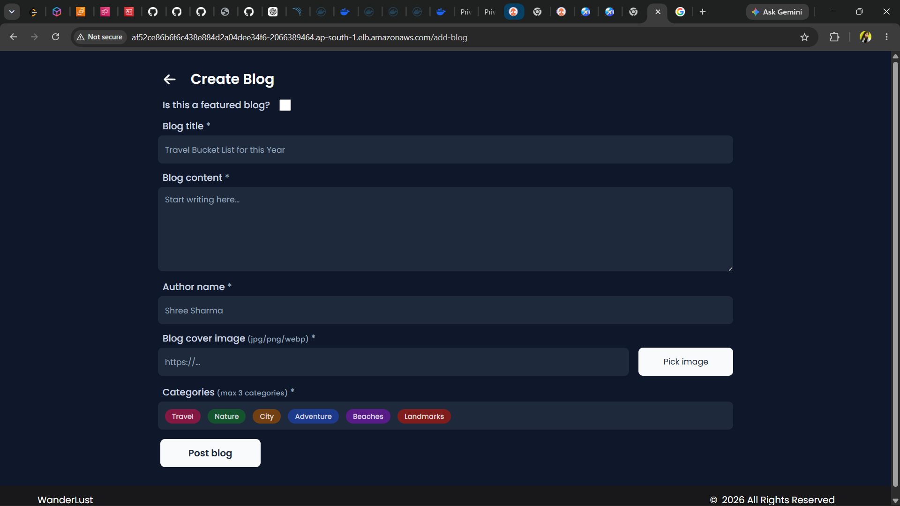

---

# 📂 Project Structure

```bash
Wanderlust-Mega-Project-k8s
│
├── frontend/
├── backend/
├── database/
├── kubernetes/
│   ├── frontend.yaml
│   ├── backend.yaml
│   ├── mongodb.yaml
│   ├── redis.yaml
│   ├── ingress.yaml
│   ├── persistentVolume.yaml
│   └── persistentVolumeClaim.yaml
│
├── Automations/
├── GitOps/
├── Assets/
├── Jenkinsfile
├── docker-compose.yml
└── README.md
```

---

# 🎯 Key Features

✅ Jenkins CI/CD Pipeline

✅ SonarQube Code Analysis

✅ Trivy Security Scanning

✅ Dockerized MERN Application

✅ DockerHub Integration

✅ Amazon EKS Deployment

✅ Kubernetes Orchestration

✅ ArgoCD GitOps Workflow

✅ Helm Package Management

✅ NGINX Ingress Controller

✅ Prometheus Monitoring

✅ Grafana Dashboards

✅ MongoDB Integration

✅ Redis Integration

---

# 🎯 Key Achievements

- Built a complete end-to-end DevOps workflow.
- Implemented GitOps deployment strategy using ArgoCD.
- Automated container image deployment using Jenkins.
- Integrated code quality checks with SonarQube.
- Added container security scanning with Trivy.
- Deployed monitoring stack using Helm.
- Configured Prometheus and Grafana dashboards.
- Hosted application on Amazon EKS.

---

# 👩‍💻 Author

## Riya Raj

GitHub Profile:

https://github.com/Riya-te

Project Repository:

https://github.com/Riya-te/Wanderlust-Mega-Project-k8s

---

# ⭐ Support

If you found this project useful, please consider giving it a ⭐ on GitHub.
